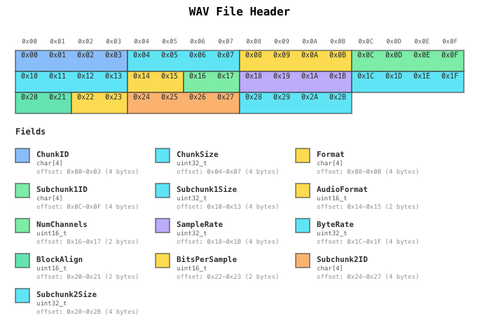
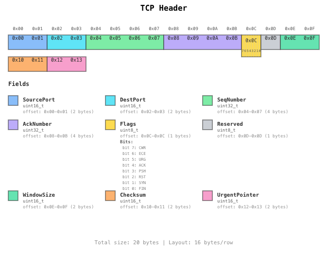
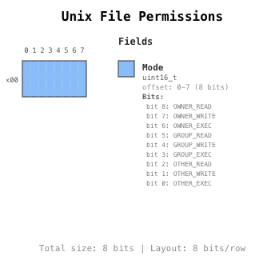

# ByteGrid

> Visualize binary data and C struct memory layouts in Obsidian

**ByteGrid** is an Obsidian plugin that transforms YAML definitions into beautiful, interactive SVG diagrams showing memory layouts of binary data structures.

Perfect for reverse engineering, protocol analysis, file format documentation, and understanding low-level data structures.

## ✨ Features

- 🎨 **Auto Color Assignment** - Fields are automatically color-coded for easy distinction
- 📏 **Byte-Accurate Layouts** - Precise grid-based visualization of memory structures
- 🔍 **Bitfield Support** - Visualize individual bits within bytes
- 🎯 **Multiple Layout Modes** - Byte-level or bit-level layouts
- 🌈 **Color Schemes** - Default, dark, and light modes
- 📊 **Flexible Legend** - Customizable position (left, right, bottom) and multi-column support
- 📐 **Row-Major Ordering** - Intuitive left-to-right field arrangement

## 📸 Screenshots

### WAV File Header



### TCP Header with Bitfields



### Unix File Permissions with Bitfields



## 🚀 Installation

### From Obsidian Community Plugins (Recommended)

1. Open Obsidian Settings
2. Go to **Community Plugins** and disable Safe Mode
3. Click **Browse** and search for "ByteGrid"
4. Click **Install**, then **Enable**

### Manual Installation

1. Download the latest release from [GitHub Releases](https://github.com/waaraawa/ByteGrid/releases)
2. Extract `main.js`, `manifest.json`, and `styles.css` into your vault's `.obsidian/plugins/bytegrid/` folder
3. Reload Obsidian
4. Enable the plugin in Settings → Community Plugins

## 📖 Usage

### Basic Example

Create a code block with the `bytegrid` language tag:

````markdown
```bytegrid
name: Simple Structure
size: 16
layout: 16

fields:
  - offset: 0-3
    name: ID
    type: uint32_t
  - offset: 4-7
    name: Timestamp
    type: uint32_t
  - offset: 8-11
    name: Value
    type: float
  - offset: 12-15
    name: Checksum
    type: uint32_t
```
````

### Configuration Options

```yaml
name: Structure Name # Required: Name of the structure
size: 16 # Required: Total size in bytes
layout: 16 # Optional: Bytes per row (default: 16)
layoutUnit: byte # Optional: 'byte' or 'bit' (default: byte)

# Color Options
autoColor: true # Optional: Auto-assign colors (default: true)
colorScheme: default # Optional: 'default', 'dark', or 'light'

# Legend Options
legendPosition: right # Optional: 'right', 'left', 'bottom', 'none'
legendColumns: 1 # Optional: Number of columns in legend (default: 1)

# Other Options
showFooter: true # Optional: Show footer (default: true)

fields:
  - offset: 0-3 # Required: Byte range (SSOT)
    name: FieldName # Required: Field name
    type: uint32_t # Required: Data type
    color: blue # Optional: Explicit color
    description: '...' # Optional: Description
    endianness: little # Optional: 'little' or 'big'
    bitfields: # Optional: Bit-level fields
      - name: Flag1
        bits: '0-3'
        description: '...'
```

### Supported Data Types

**Integer Types:**

- `char`, `int8_t`, `uint8_t`
- `int16_t`, `uint16_t`, `short`
- `int32_t`, `uint32_t`, `int`
- `int64_t`, `uint64_t`, `long`

**Floating Point:**

- `float`, `double`

**Arrays:**

- `char[4]`, `uint8_t[16]`, etc.

**Special:**

- `reserved`, `padding` (always gray)

### Color Palette

When `autoColor: true` (default), fields cycle through these colors:

- 🔵 blue
- 🔷 cyan
- 🟡 yellow
- 🟢 green
- 🟠 orange
- 🟣 purple
- 🟢 mint
- 🩷 pink

## 📚 Examples

Check the [examples](./examples) folder for more:

- WAV audio file headers
- TCP/IP headers with bitfields
- ELF binary formats
- Unix file permissions
- CPU flags registers

## 🛠️ Development

### For Plugin Development

```bash
# Install dependencies
npm install

# Build all packages
npm run build

# Run tests
npm run test

# Development mode (watch)
cd packages/obsidian-plugin
npm run dev
```

### Project Structure

```
bytegrid/
├── packages/
│   ├── core/              # Core rendering engine
│   └── obsidian-plugin/   # Obsidian plugin wrapper
└── examples/              # Example files
```

## 🤝 Contributing

Contributions are welcome! Please feel free to submit a Pull Request.

### Development Guidelines

- Follow **Test-Driven Development (TDD)**
- Write tests before implementation
- Use TypeScript strict mode
- Follow existing code style (ESLint + Prettier)

### Key Design Principles

- **offset is SSOT** - Field size calculated from offset ranges
- **No magic numbers** - Use constants for layout values
- **Dynamic sizing** - Calculate dimensions from content
- **Explicit padding** - Use `reserved` or `padding` types

## 📝 License

MIT License - see [LICENSE](./LICENSE) for details

## 🙏 Acknowledgments

Built with:

- [Obsidian API](https://github.com/obsidianmd/obsidian-api)
- [js-yaml](https://github.com/nodeca/js-yaml)
- TypeScript & esbuild

## 📮 Support

- 🐛 [Report a bug](https://github.com/waaraawa/ByteGrid/issues)
- 💡 [Request a feature](https://github.com/waaraawa/ByteGrid/issues)
- 📖 [Read the documentation](./examples/README.md)

---

Made with ❤️ for the Obsidian community
